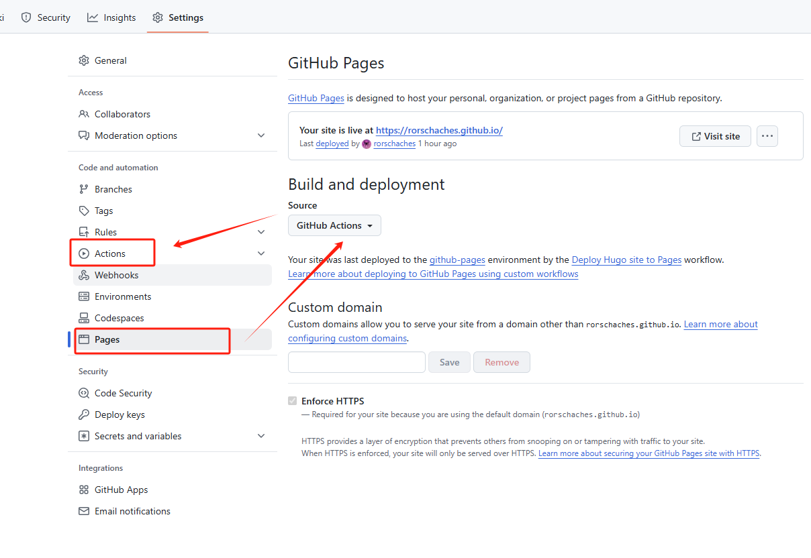
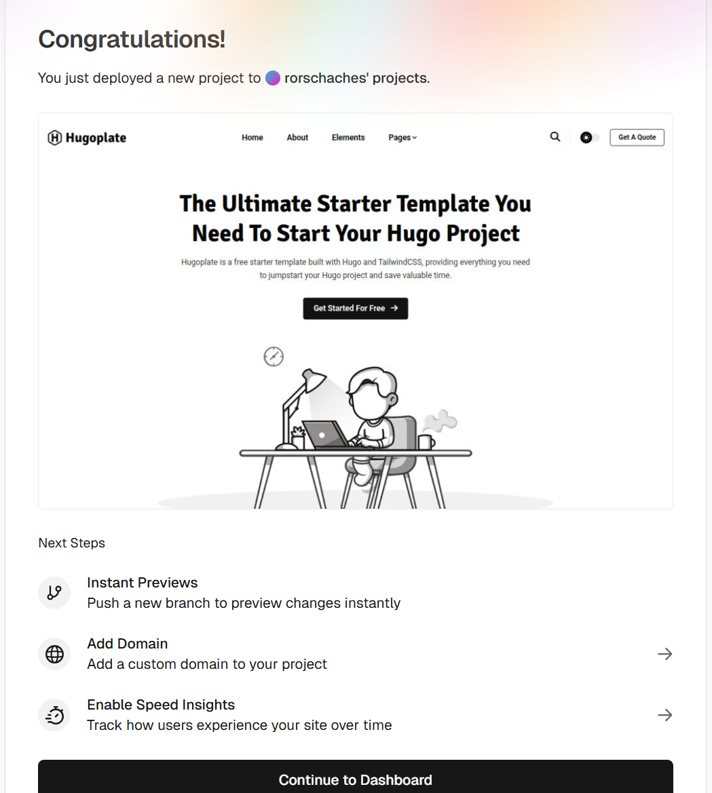

先展示几个博客的 Demo：

[coreychiu](https://coreychiu.com/)

[Congo](https://jpanther.github.io/congo/)

[Hugoplate](https://zeon.studio/preview?project=hugoplate)

最近心潮澎湃，想自己搭建一个自己的个人主页，于是搜集了些资料，开始行动。
大部分博客建站的域名需要修改申请，尝试了一些平台最后选择了`HUGO`+`Github`的部署形式，下文也提供了在`Vercel`上部署的说明（vercel 支持个人博客免费部署）。

# HUGO 环境的本地安装
对于不需要本地调试的话，可以不安装本地环境（Maybe ）

## 安装依赖 HUGO
这里我选择的模板是只支持Hugo Extended，不同的模板可能不同，可以先去HUGO 主题网站选择一个中意的模板再进行搭建。
- [Hugo Extended v0.144+](https://gohugo.io/installation/)
-在Linux环境用终端命令进行安装，以下命令只需要选择一个即可：
``` bash
## HUGO
# 安装标准版本
sudo apt install hugo
# To build the extended edition:
CGO_ENABLED=1 go install -tags extended github.com/gohugoio/hugo@latest
# To install the extended edition of Hugo: 
sudo snap install hugo
```
也可以再github找到安装压缩包，进行手动安装。

### Hugo安装过程可能遇到的问题

之前是直接`apt install`用的debian仓库版本，但太老了，还一直停在0.111.3版本，而且apt安装还会附带一大堆其它包，提示需要几百MB的存储空间，所以这次放弃apt，直接到github仓库下载二进制安装包。
github指路：[https://github.com/gohugoio/hugo/releases](https://github.com/gohugoio/hugo/releases)

下载对应系统、对应硬件架构的版本，然后添加环境变量。

- windows：把压缩包解压到`D:\hugo`并把路径添加到环境变量，高级系统设置—>环境变量—>系统变量—>path，保存退出。
- linux：把压缩包解压到`/opt/hugo`并把路径添加到`.bashrc`，在末尾加一行`export PATH=$PATH:/opt/hugo`，然后`source ~/.bashrc`让变更生效。
配置完以后，敲命令`hugo -h`看是否正常输出。

## 安装依赖 Node
网络不稳定的话，同样可以下载压缩包进行本地安装。
- [Node v22+](https://nodejs.org/en/download/)

```bash
## Node
# Download and install nvm:
curl -o- https://raw.githubusercontent.com/nvm-sh/nvm/v0.40.2/install.sh | bash
# in lieu of restarting the shell
\. "$HOME/.nvm/nvm.sh"
# Download and install Node.js:
nvm install 22
# Verify the Node.js version:
node -v # Should print "v22.14.0".
nvm current # Should print "v22.14.0".
# Verify npm version:
npm -v # Should print "10.9.2".
```

## 安装依赖 Go
Hugo中会涉及go语言，所以要安装依赖。
- [Go v1.24+](https://go.dev/doc/install)
```bash
## go
# 1.**Remove any previous Go installation**
rm -rf /usr/local/go && tar -C /usr/local -xzf go1.24.2.linux-amd64.tar.gz
# 2.Add /usr/local/go/bin to the `PATH` environment variable
export PATH=$PATH:/usr/local/go/bin
# 3.Verify that you've installed Go
 go version
```


# Theme Page 的选择
这里用`Congo`做示范，这个模板比较适合喜欢深度探索的朋友，如果想下载即用，可以选择后边给出的几个推荐的博客模板。
## Congo 主题
[jpanther/congo: A powerful, lightweight theme for Hugo built with Tailwind CSS.](https://github.com/jpanther/congo)
### 初始化

```bash
### Create a new site, <mywebsite-name> is your site name
hugo new site mywebsite_name

cd mywebsite_name

git init

git submodule add -b stable https://github.com/jpanther/congo.git themes/congo
```

### 配置你的 hugo site

新建`config/_default`文件夹，可以添加各种 toml 配置文件，可以从模板中直接拷贝，详细的DIY可参见模板网站。
``` .
config/_default/
├─ hugo.toml
├─ languages.en.toml
├─ markup.toml
├─ menus.toml
└─ params.toml
``` 

新建`content`文件夹，以下便是你博客的内容，使用md格式撰写，主目录下的index是你的主页，content的第一个子文件需要和配置文件`menus.toml`中的`pageRef`相对应。


``` .
└── content
    └── posts
        ├── _index.md
        └── first-post
            ├── cover.jpg
            ├── index.md
            └── thumb.jpg
```

目前为止，网站就具备了雏形，后边可以按照网站的模板教程，一步一步高阶配置。

### 本地调试

```bash
## Install dependencies
cd themes/congo
npm install

### Run the Tailwind compiler
cd ../..
./themes/congo/node_modules/tailwindcss/lib/cli.js -c ./themes/congo/tailwind.config.js -i ./themes/congo/assets/css/main.css -o ./assets/css/compiled/main.css --jit
```

To fully complete this solution, you can simplify this whole process by adding aliases for these commands, or do what I do and add a `package.json` to the root of your project which contains the necessary scripts. 
```json
{
  "name": "my-website",
  "version": "1.0.0",
  "description": "",
  "scripts": {
    "server": "hugo server -b http://localhost -p 8000",
    "dev": "NODE_ENV=development ./themes/congo/node_modules/tailwindcss/lib/cli.js -c ./themes/congo/tailwind.config.js -i ./themes/congo/assets/css/main.css -o ./assets/css/compiled/main.css --jit -w",
    "build": "NODE_ENV=production ./themes/congo/node_modules/tailwindcss/lib/cli.js -c ./themes/congo/tailwind.config.js -i ./themes/congo/assets/css/main.css -o ./assets/css/compiled/main.css --jit"
  }
}
```

Now when you want to work on designing your site, you can invoke `npm run dev` and the compiler will run in watch mode. When you’re ready to deploy, run `npm run build` and you’ll get a clean Tailwind CSS build.
or by `hugo server` to built all project. 

注：因为hugo v0.146.5 目前有些bug，暂时不能本地调试。
```
Error: html/template:_shortcodes/figure.html:2:14: no such template "_internal/shortcodes/figure.html"
```

## Hugoplate 主题
[hugoplate: Hugoplate is a free starter template built](https://github.com/rorschaches/hugoplate)
```bash
###  Project Setup
npm run project-setup
###  Install Dependencies
npm install
###  Development Command
npm run dev
```

## coreychiu-portfolio-template 主题
[iAmCorey/coreychiu-portfolio-template: portfolio template by corey chiu](https://github.com/iAmCorey/coreychiu-portfolio-template)

```bash
# 安装pnpm
npm install -g pnpm
# 安装pnpm 依赖
npm install 
# 部署
pnpm dev
```

# 在线部署
本地调试编辑完之后将项目push到github仓库。
## 使用 Github 部署
在建立仓库的settings页面选择page，将`Build and deployment` 下的 `source` 改成 `github actions`



这时下方应该会出现action的类型，选择hugo的workflow，添加yml文件。
然后点击`action`设置你的action，可以不设置，选择默认。
在最顶端导航栏的`action`菜单中即可看到你的个人主页部署列表。

## 使用 Vercel 部署 
https://vercel.com
使用github账号登陆
- 点击New Project，选择你的代码仓库（支持GitHub、GitLab、本地文件或新建模板）。
- 选择仓库中的项目目录进行部署。
  



